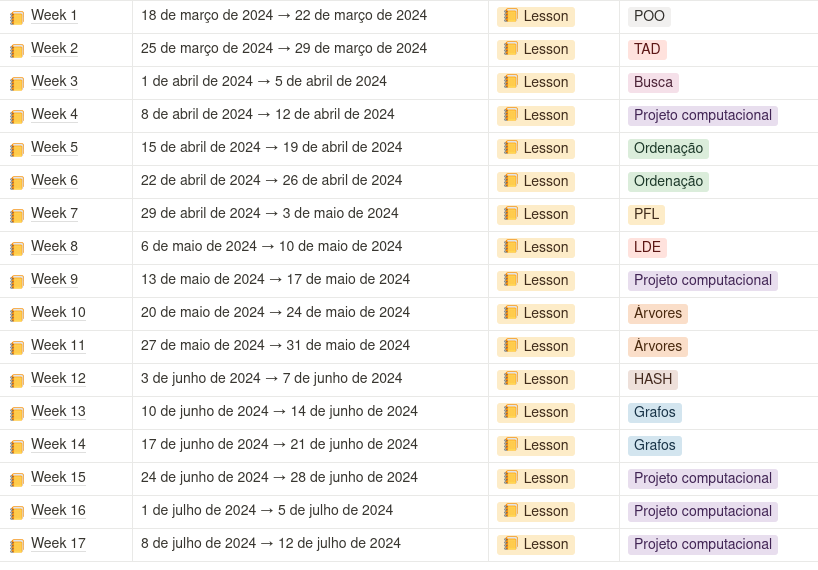

# Algoritmos e estrutura de dados (AED)
## Objetivo
Apresentar ao aluno as mais importantes estruturas de dados e seus
algoritmos, permitindo assim o desenvolvimento de conhecimentos,
habilidades, competências e autonomia para o desenvolvimento de
soluções algorítmicas eficientes para uso em sistemas computacionais,
especialmente em redes de comunicação e na computação de dados.

## Ementa do programa
Desenvolvimento sistemático de algoritmos. Algoritmos triviais em soluções
computacionais. Conceitos de elaboração e teste de algoritmos. Conceitos de
modularidade e refinamentos sucessivos. Estruturas de dados homogêneas e
heterogêneas. Introdução às estruturas de dados estáticas e dinâmicas
(ponteiros). Desenvolvimento de algoritmos de ordenação e busca.
Complexidade computacional. Aplicações de algoritmos e estrutura de dados
em problemas de redes de comunicação e na computação de dados.

## Metodologia

* Os autores Lilian Bacich e José Moran destacam: uma abordagem teórico-prática.
* O autor Paulo Freire, em seu livro “Pedagogia da Autonomia” destaca que:
o processo de ensino e aprendizagem está em conexão com a perspectiva
construtivista, no qual as partes interessadas trocam conhecimentos.
* Na disciplina de Algoritmos e Estruturas de Dados serão abordadas as
metodologias de ensino supramencionadas.

## Critérios de avaliação
* Duas Provas práticas de pesos distintos, Exercícios práticos e um Projeto computacional.
* Para o cálculo da média final da disciplina, consideram-se as seguintes
medidas:

Módulo 01: $M01 = 0,9*P1 + 0,1*EX$

Módulo 02: $M02 = 0,8*P2 + 0,2*EX$

Módulo 03: $M03 = 0,8*PC + 0,2*EX$ no M02

Média Final: $MF = (M01 + M02 + M03) / 3$

O aluno terá de satisfazer os seguintes requisitos, para obter a aprovação na disciplina:

**Aprovação** se NF ≥ 5,0 e se Percentual de faltas (PF) for PF < 25%. Onde PF é dado pelo número de aulas com faltas registradas dividido pelo número de aulas ministradas.

**Reprovação** se NF < 5,0 ou se PF 25%, então o aluno será considerado reprovado por nota ou por falta. Não serão aceitas atividades fora do prazo e por e-mail.

**Pontualidade na entrega das avaliações**. O não recebimento dos trabalhos, projeto e/ou tarefa; ou a não apresentação do mesmo acarretará na perda dos pontos correspondentes.
As notas no Projeto Computacional serão correspondentes a participação e apresentação nas prévias referentes ao Projeto. Portanto, o aluno precisa participar das prévias e da apresentação final. (1) O aluno receberá nota = 1,0 (10% da nota do projeto), caso participe apenas da apresentação final e; (2) O aluno receberá nota = 1,0 (10% da nota do projeto), caso participe apenas das prévias. Dentre os critérios que serão avaliados no PC, destacam-se: atualidade, complexidade, relevância, implementação e características reconhecidamente exitosas ou inovadoras.

Caso o aluno falte a alguma das provas e apresente atestado médico, terá como média final na disciplina a média aritmética dos demais módulos.

## Cronograma
**Conteúdo**

**Ensaios de trabalho**

**Provas**

## Bibliografia básica
1. Cormen, T. H.; Leiserson, C. E.; Rivest, R. L. & Stein - Algoritmos: teoria e prática. 2ª ed., Editora Campus, Rio de Janeiro, 2002.
2. Drozdek, A. Estrutura de Dados e algoritmos em C++. Cengage Learning, 2003. Número da obra: 154546 / Classificação: 004.021
3. Tanenbaum, A. M., Langsam, Y., Augenstein, M. J. - Estruturas de dados usando C. Makron Books. São Paulo. 1995

## Bibliografia complementar
1. Koenig, A; Moo, B. E. - Accelerated C++. Addison Wesley, 2000.
2. Rodrigues, Pimenta. Programação Em C++ - Algoritmos e Estrutura de Dados - 3ª ed - Editora: LIDEL - ZAMBONI, 2012.
3. Szwarcfiter, Jayme Luiz - Estruturas de dados e seus algoritmos. LTC, Rio de Janeiro, 1994.
4. Gersting, J. L. - Fundamentos matemáticos para a ciência da computação. 3ª ed., LTC, Rio de Janeiro, 1995.
5. Guimarães, A. M.; Lages, N. A. C. - Algoritmos e estruturas de dados. 2ª ed., LTC, Rio de Janeiro, 1994.
[isocpp](https://isocpp.org/get-started)
[Bjarne's tour](https://isocpp.org/tour)
[cpp reference](https://en.cppreference.com/w/)